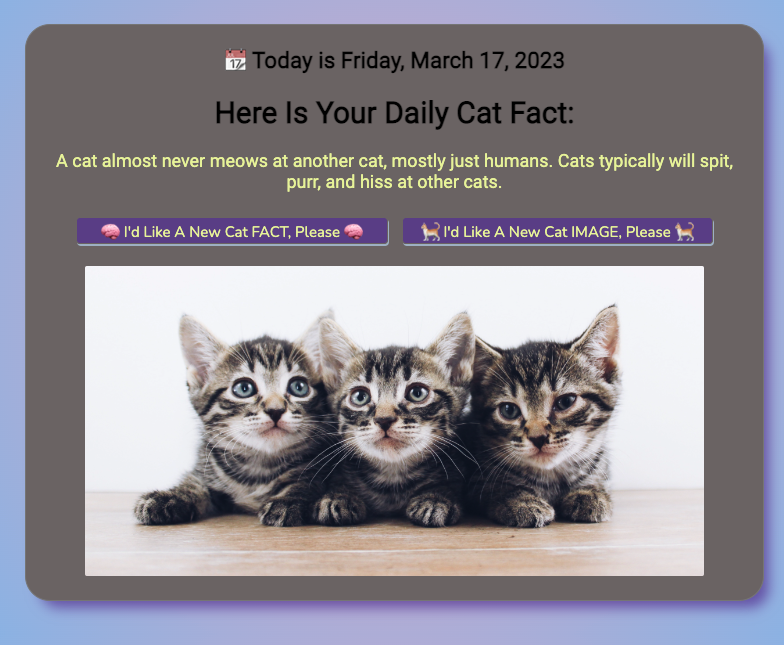

# 🐈 KITTIES 🐈

### 1. Project Description

Thinking, thinking..... and ChatGPT comes to the rescue!!!
"Welcome to our fabulous feline haven, where we dish out cat facts like they're treats from the fancy feast. From the cute and cuddly to the curious and quirky, we've got all the purrfect details on our furry overlords. So sit back, relax, and let us whisker you away into the wonderful world of cats!"

This project was created using HTML, CSS and JavaScript and is deployed [here](https://just-the-cat-facts.netlify.app/). It pulls from two APIs:

* https://catfact.ninja
* https://unsplash.com/developers

### 2. Installation Instructions

If you would like to run this application, you'll need to do the following:

* Fork the Respository
* Clone to your local environment
* Open the html file in your browser.
* You'll need an API key from the unplash API - first, create a .env file at the top level of your directory, and then set your key to a global variable aka `API_KEY = "thisismyapikey"`

### 3. Feedback and Contributions

If you would like to contribute to this tiny but pretty darned cute project, please submit a pull request. 

  

### 4. Note

As per Favicon.io, emoji graphics are from the open source project Twemoji[https://twemoji.twitter.com/]. The graphics are copyright 2020 Twitter, Inc and other contributors and are licensed under CC-BY 4.0[https://creativecommons.org/licenses/by/4.0/]. 

